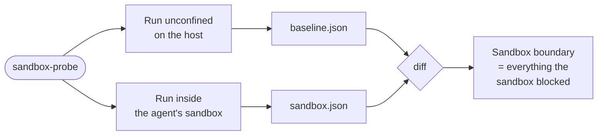
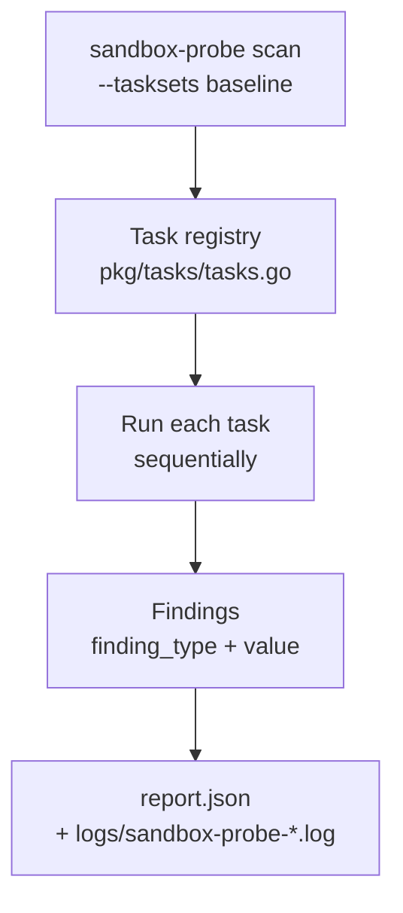

# Sandbox Probe

"Do I trust this sandbox?" is a faith-based question — and faith is a rotten foundation for a threat model. Every AI coding agent ships with a story about what its sandbox can and cannot do: container policies, [Landlock](https://landlock.io/) rules, seccomp filters, "we only allow reads from the workspace". That story is the vendor's map. You are defending the territory: a developer's laptop, with dotfiles, an SSH agent, cloud credentials, and an agent that any sufficiently clever prompt injection might persuade to go for a wander.

`sandbox-probe` is a single static Go binary you drop *inside* the sandbox — [Claude Code](https://code.claude.com/docs/en/overview), [Gemini CLI](https://geminicli.com/), [`nono`](https://github.com/always-further/nono), a container, whatever — and let it look around. Run it once on the bare host for a baseline, then again inside the agent. The diff between the two reports is the sandbox boundary, measured rather than assumed. If it shows the agent can read `~/.aws/credentials`, resolve arbitrary DNS, or reach `169.254.169.254`, tighten the policy before you ship another line of code through it.

## Table of contents

- [Who this is for](#who-this-is-for)
- [How it works](#how-it-works)
- [What it detects](#what-it-detects)
- [Reading a report](#reading-a-report)
- [Quick start](#quick-start)
- [Testing an agent's sandbox](#testing-an-agents-sandbox)
- [CLI reference](#cli-reference)
- [Report format](#report-format)
- [Supported code assistants](#supported-code-assistants)
- [Installation](#installation)
- [Development](#development)

## Who this is for

Four concrete scenarios `sandbox-probe` is built to answer:

- **Assessing an AI coding agent's blast radius.** You let developers use Claude Code, Gemini CLI, or similar; you want a concrete inventory of what a compromised agent could read, write, or reach from inside its sandbox.
- **Tuning a sandbox policy.** You're writing Landlock rules (via [`nono`](https://github.com/always-further/nono)), a seccomp profile, or a container policy and need before-and-after evidence that the rule you added actually closed the door you intended.
- **Detecting sandbox regressions over time.** Run the probe in your agent's sandbox on every release of the agent (or your wrapper) and alert when the boundary widens — for example, a new agent version starts seeing `~/.aws/credentials`.
- **Comparing sandboxes apples-to-apples.** Feed the same probe to Claude Code, Gemini, a `nono` policy, and a Docker container; the reports are directly comparable because the methodology is identical.

## How it works

A scan is a single static Go binary that runs a registry of *tasks* — each task tries one class of action (read a sensitive path, scan ports, fingerprint the sandbox runtime, …) and records whatever the kernel let it do. Tasks are grouped into *tasksets* (`baseline`, `ps`, `all`). The output is a JSON report of findings.

The intended workflow is comparison, not absolute measurement:



Inside a single scan, the orchestration looks like this:



The 9 tasks in the `baseline` taskset:

- `baseline_path_task`
- `baseline_network_task`
- `baseline_proxy_task`
- `baseline_socket_task`
- `baseline_process_task`
- `baseline_user_context_task`
- `baseline_hostname_task`
- `baseline_sandbox_task`
- `baseline_mount_task`

The `ps` taskset adds `ps_all_task`, `ps_parent_task`, and `ps_single_task`. Tasks run sequentially and deterministically. Each returns zero or more `Finding` objects with a stable `finding_type` string, which is what makes baseline-vs-sandbox diffing meaningful.

## What it detects

Each row below is a `finding_type` string you will see in `report.json`, what it captures, and the security question it answers. The full list lives in [`pkg/tasks/tasks.go`](./pkg/tasks/tasks.go).

| `finding_type` in JSON | What it captures | The question it answers |
| --- | --- | --- |
| `sensitive_readable_paths` | readable but security-sensitive files (SSH keys, cloud credentials, browser cookies, etc.) | "Could an attacker exfiltrate my AWS keys, SSH keys, browser cookies?" |
| `writeable_paths` | writable system and home paths | "Could an attacker tamper with shell rc files, cron, systemd units?" |
| `external_host_dns_resolution` | hostnames the probe could resolve | "Can the agent see public DNS at all?" |
| `external_host_connectivity` | hosts the probe could reach over the network | "Could an attacker exfiltrate data to an external server?" |
| `tcp_ports_open` / `udp_ports_open` | locally reachable ports | "What local services is the agent exposed to?" |
| `proxy_detection` | proxy configuration in environment variables | "Is traffic forced through a proxy the agent could subvert?" |
| `unix_socket_detection` | Unix domain sockets visible from inside | "Can the agent talk to the Docker daemon, SSH agent, dbus, …?" |
| `process_detection` / `parent_process_detection` | visible processes and the launching parent | "What else is running in the same context, and who launched the agent?" |
| `mounted_volumes_detections` | mounted filesystems visible from inside | "What of the host filesystem is exposed?" |
| `user_context_detection` | UID, GID, EUID, EGID | "Is the agent running as a privileged user?" |
| `hostname_detection` | system hostname | "Does the sandbox leak the host identity?" |
| `sandbox_detection` | detected runtime (Docker, Podman, LXC, Firejail, Bubblewrap, gVisor, systemd-nspawn, WSL, OpenVZ, Seatbelt, Landlock, AppArmor) | "Is there *any* enforcement at all, and what kind?" |

## Reading a report

A finding looks like this:

```json
{
  "findingType": "sensitive_readable_paths",
  "task": "baseline_path_task",
  "description": "Sensitive readable paths",
  "value": [
    "/home/alice/.aws/credentials",
    "/home/alice/.ssh/id_ed25519"
  ]
}
```

Read it as a three-step chain: *this finding means X → which tells you Y → which suggests action Z.*

- **`sensitive_readable_paths` includes `~/.aws/credentials`** → the agent's sandbox does not block reads of cloud credentials → tighten the sandbox policy (or accept the residual risk explicitly, in writing).
- **`external_host_connectivity` includes `169.254.169.254`** → the agent can reach the cloud instance metadata service → if you're running on EC2/GCE, that's an IAM credential-theft path; block egress to link-local.
- **`sandbox_detection` is empty** → no enforcement was detected → either the runtime is one the probe doesn't fingerprint yet (file an issue) or there really is no sandbox.

The point of diffing baseline against sandbox reports is to make these decisions evidence-based: every line of difference is one capability the sandbox actually denies.

## Quick start

```bash
# Build (Go 1.25+)
make build

# Run unconfined on this host to get a baseline
./bin/sandbox-probe scan --output_path baseline.json

# Inspect findings
jq '.findings | map({findingType, task})' baseline.json
```

Then run the same binary inside an agent's sandbox and diff the two reports — see [Testing an agent's sandbox](#testing-an-agents-sandbox).

## Testing an agent's sandbox

The core pattern lives in the [`tests/`](./tests) directory: two parallel scripts per agent, one that runs the probe unconfined, one that runs it inside the agent's sandbox.

```
tests/
├── baseline_nono.sh                  # probe runs under a permissive nono policy
├── baseline_claude.sh                # probe runs unconfined; Claude Code is just the runner
├── baseline_gemini.sh                # ... same for Gemini
├── sandbox_nono.sh                   # probe runs under a restrictive nono policy
├── sandbox_claude.sh                 # Claude Code runs the probe inside its real sandbox
├── sandbox_gemini.sh                 # ... same for Gemini
├── detect_docker.sh                  # probe runs inside Docker
├── detect_podman.sh                  # probe runs inside Podman
├── detect_bwrap.sh                   # probe runs inside Bubblewrap
├── detect_claude.sh                  # probe runs inside Claude Code's own sandbox (real binary, model stubbed — no LLM)
├── detect_codex.sh                   # ... same for Codex
└── detect_gemini.sh                  # ... same for Gemini
```

Reports land in `./reports/`. A typical diff workflow:

```bash
./tests/baseline_claude.sh
./tests/sandbox_claude.sh

diff <(jq -S . reports/baseline-claude.json) \
     <(jq -S . reports/sandbox-claude.json)
```

[`nono`](https://github.com/always-further/nono) plays two roles in this repo: it's a Landlock (Linux) / Seatbelt (macOS) wrapper that applies a sandbox policy to any binary, so we use it (a) as a *harness* to run the probe under a known policy and (b) as one of the *sandboxes whose enforcement we're characterising*. The two `nono` scripts demonstrate both modes.

> [!IMPORTANT]
> The `sandbox_claude.sh` and `sandbox_gemini.sh` scripts ask a real AI agent to execute the probe binary. Consider the risk that the agent could take other actions, especially on non-interactive/YOLO modes. Pure-sandbox runs (`sandbox_nono.sh`, `detect_docker.sh`, etc.) don't involve an agent and don't carry this risk.
>
> You can reduce the risk by using the interactive variants (`*_interactive.sh`), but the agent may still take autonomous action you don't expect.

For more detail see [`docs/CONTRIBUTING.md`](./docs/CONTRIBUTING.md#trialling-against-agent-sandboxes).

## CLI reference

### `scan`

Run the configured tasks and write a JSON report.

```bash
./bin/sandbox-probe scan [flags]
```

| Flag | Description | Default |
| --- | --- | --- |
| `--tasksets` | Comma-separated tasksets to run: `baseline`, `ps`, `all` | `baseline` |
| `--tasks` | Additional individual tasks to run (comma-separated) | _none_ |
| `--output_path` | Path to write the JSON report | `report.json` |
| `--tags` | Metadata tags to append to the report (comma-separated) | _none_ |
| `--fast` | Skip "likely safe" paths for quicker iteration | `false` |

Examples:

```bash
# Default: baseline taskset to ./report.json
./bin/sandbox-probe scan

# Multiple tasksets, with tags written into the report metadata
./bin/sandbox-probe scan --tasksets baseline,ps --tags test,docker

# Single named task only
./bin/sandbox-probe scan --tasks baseline_network_task

# Custom output path
./bin/sandbox-probe scan --output_path results.json
```

### `tasks list`

List every registered task with its description.

```bash
./bin/sandbox-probe tasks list
```

The canonical task list (currently 12 tasks across two tasksets) is the output of this command.

### `version`

Print version, git commit, and build date.

```bash
./bin/sandbox-probe version
```

Example output:

```
version dev
git commit 44f7a7bcd2d3ae4215de43dd4d893c3b24587f40
build date 2026-05-16T10:39:11Z
```

## Report format

A report is a JSON object with these top-level fields:

- `version` — report schema version (currently `1.0.0`)
- `timestamp` — when the scan ran
- `probeBinary` — Go version, OS, arch, static flag, binary version, commit, build date
- `metadata` — user-provided tags from `--tags`
- `findings` — array of `Finding` objects (see below)

Each `Finding` has four fields, defined in [`api/proto/report/v1/report.proto`](./api/proto/report/v1/report.proto):

- `findingType` — a stable string key (see [What it detects](#what-it-detects)); the field you diff on
- `task` — which task produced the finding (e.g. `baseline_path_task`)
- `description` — human-readable label
- `value` — the actual data; shape depends on `findingType` (string, list of strings, list of ints, or a structured object for processes / user identity / proxy config)

Example report fragment:

```json
{
  "version": "1.0.0",
  "timestamp": "2026-05-16T15:30:45Z",
  "probeBinary": {
    "goVersion": "go1.25.0",
    "os": "linux",
    "arch": "amd64",
    "static": false
  },
  "metadata": {
    "tags": ["claude-code", "sandbox-run"]
  },
  "findings": [
    {
      "findingType": "sandbox_detection",
      "task": "baseline_sandbox_task",
      "description": "Sandbox/container runtime",
      "value": "landlock"
    },
    {
      "findingType": "sensitive_readable_paths",
      "task": "baseline_path_task",
      "description": "Sensitive readable paths",
      "value": ["/home/alice/.ssh/id_ed25519"]
    }
  ]
}
```

The console output during a scan is structured logs; the same data is also written to a timestamped log file under `logs/` (e.g. `logs/sandbox-probe-2026-05-16-15-30-45.log`).

## Supported code assistants

The included test scripts target:

- **[Claude Code](https://code.claude.com/docs/en/overview)** — see `tests/baseline_claude.sh`, `tests/sandbox_claude.sh` (which drive a real, billed agent), and `tests/detect_claude.sh` (the deterministic, no-LLM path described below)
- **[Gemini CLI](https://geminicli.com/)** — see `tests/baseline_gemini.sh`, `tests/sandbox_gemini.sh` (and `*_interactive.sh` variants)

### Agent sandboxes with no LLM

Driving a real agent to run the probe costs tokens and is non-deterministic. So we exercise each agent's **real** sandbox with **no model call, no API key, and no tokens**: one general mock ([`scripts/mock-agent-api.mjs`](./scripts/mock-agent-api.mjs)) speaks five wire protocols — Anthropic (`/v1/messages`), Gemini (`:streamGenerateContent`), OpenAI Responses (`/v1/responses`, Codex), OpenAI Chat Completions (`/v1/chat/completions`, streaming and non-streaming — OpenCode/Goose/Pi/gptme/Cline) and Ollama (`/api/chat`, wired for a future native-Ollama agent; not yet exercised by a matrix row) — and returns a canned shell tool call that runs the probe (shaping the argument from each tool's own schema — e.g. Cline's `run_commands` takes a `commands` array). The real agent binary — pointed at the mock via its base-URL override — then executes it inside whatever OS sandbox it ships ([bubblewrap](https://github.com/containers/bubblewrap) on Linux, Seatbelt on macOS, a container for Gemini; OpenCode, Goose, Pi, gptme and Cline ship none, so those rows run unconfined). See `scripts/run-probe-via-{claude,gemini,codex,opencode,goose,pi,gptme,cline}-stub.sh`.

This is what CI runs. The [`scan-matrix`](./.github/workflows/scan-matrix.yaml) workflow builds the probe and runs it across a **harness** axis — one row per way of executing the probe:
- `direct` (unconfined baseline, on linux/macos/windows), and each agent as-is vs its own sandbox: `claude`/`claude-sandbox`, `codex`/`codex-sandbox`, `gemini`/`gemini-docker`/`gemini-sandbox-exec`, and the unconfined `opencode` (linux/macos/**windows**) / `goose` / `pi` / `gptme` / `cline`.
- keyless **sandbox runtimes** that wrap the probe directly (no agent, no model): `srt` ([Anthropic sandbox-runtime](https://github.com/anthropic-experimental/sandbox-runtime) — bubblewrap/Seatbelt + network proxy), `firejail` (SUID namespaces + seccomp), `nono` ([nono.sh](https://nono.sh) — Landlock/Seatbelt capability sandbox), `podman` / `docker` (OCI containers), `bwrap` (standalone bubblewrap — the invocation the probe fingerprints as `bubblewrap`, unlike Claude Code / srt; see [#38](https://github.com/controlplaneio/sandbox-probe/issues/38)), `nspawn` (systemd-nspawn container) and `gvisor` (userspace-kernel sandbox via `runsc run`, systrap platform). See `scripts/run-probe-in-sandbox.sh`.

Every row is keyless. Diffing an agent against its `-sandbox` row is precisely what that sandbox blocks. Adding another harness (another agent, another runtime) is one matrix row plus a family-gated setup/run step.

Any AI agent that will run an arbitrary binary works in principle — the probe doesn't depend on the agent. Contributions of test scripts for other agents are welcome.

## Installation

### Prerequisites

For building:

- Go 1.25 or later
- Protocol Buffer compiler (`buf`) — install via `make install-buf` (only required if you change the protobuf definitions)

For end-to-end testing (depending on which sandboxes you want to exercise):

- `jq` — JSON processor for parsing reports
- `docker` and/or `podman` — for containerised testing
- `claude-code` — Claude Code CLI for Claude testing
- `gemini-cli` — Gemini CLI for Gemini testing
- [`nono`](https://github.com/always-further/nono) — a Landlock/Seatbelt wrapper for AI agents and other programs

### Build from source

```bash
git clone https://github.com/controlplaneio/sandbox-probe.git
cd sandbox-probe
make build
```

If you intend to run `sandbox-probe` inside a container, make sure it is built statically with standard library paths, or arrange for the relevant paths to be mounted in. This isn't usually an issue but can bite on non-glibc or non-FHS systems like Alpine, NixOS, or anything via Nix.

## Development

The full task list (also obtainable from `./bin/sandbox-probe tasks list`):

| Task | Description |
| --- | --- |
| `baseline_path_task` | Scans filesystem for writable and sensitive readable paths |
| `baseline_network_task` | Scans network for DNS resolution, connectivity, and open TCP/UDP ports |
| `baseline_proxy_task` | Detects proxy configuration from environment variables |
| `baseline_socket_task` | Scans filesystem for Unix domain sockets |
| `baseline_process_task` | Detects running processes and parent process information |
| `baseline_user_context_task` | Detects user and group context information (UID, GID, EUID, EGID) |
| `baseline_hostname_task` | Detects the system hostname |
| `baseline_sandbox_task` | Detects container runtime and sandbox environments (Docker, Podman, LXC, etc.) |
| `baseline_mount_task` | Detects host-mounted volumes and filesystem mounts |
| `ps_all_task` | Lists all running processes using `ps` |
| `ps_parent_task` | Gets parent process information using `ps` |
| `ps_single_task` | Gets information about the running process using `ps` |

Adding a new task is a matter of implementing the `Task` interface ([`pkg/tasks/tasks.go`](./pkg/tasks/tasks.go)) and registering it in `taskRegistry` (and, if appropriate, in a `taskSetRegistry` entry). Findings the new task returns must have a `finding_type` registered in `expectedTypes` for runtime validation to pass.

See [`docs/CONTRIBUTING.md`](./docs/CONTRIBUTING.md) for the full contributor guide.
