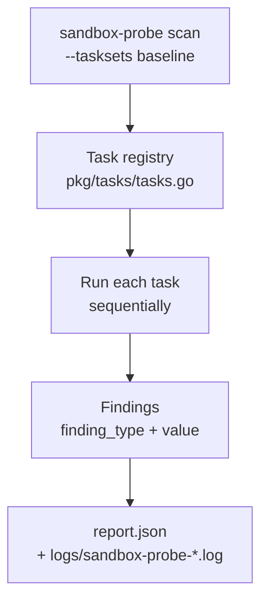

# Sandbox Probe

"Do I trust this sandbox?" is a faith-based question — and faith is a rotten foundation for a threat model. Every AI coding agent ships with a story about what its sandbox can and cannot do: container policies, [Landlock](https://landlock.io/) rules, seccomp filters, "we only allow reads from the workspace". That story is the vendor's map. You are defending the territory: a developer's laptop, with dotfiles, an SSH agent, cloud credentials, and an agent that any sufficiently clever prompt injection might persuade to go for a wander.

`sandbox-probe` is a single static Go binary you drop *inside* the sandbox — [Claude Code](https://code.claude.com/docs/en/overview), [Gemini CLI](https://geminicli.com/), [`nono`](https://github.com/nolabs-ai/nono), a container, whatever — and let it look around. It records what the kernel let it do and writes one JSON report. If that report shows it could read `~/.aws/credentials`, resolve arbitrary DNS, or reach `169.254.169.254`, tighten the policy before you ship another line of code through it.

This repository is the probe and nothing else. The comparison harness built on top of it — the scan matrix, the seeder, the agent stubs, the baseline-normalised methodology and the published results — lives in [`sandbox-probe-reports`](https://github.com/controlplaneio/sandbox-probe-reports), and its site publishes at <https://controlplaneio.github.io/sandbox-probe-reports/>. (It was previously published from this repository; that is the new address.)

## Table of contents

- [Who this is for](#who-this-is-for)
- [How it works](#how-it-works)
- [What it detects](#what-it-detects)
- [Reading a report](#reading-a-report)
- [Quick start](#quick-start)
- [CLI reference](#cli-reference)
- [Custom path expectations](#custom-path-expectations)
- [Report format](#report-format)
- [Installation](#installation)
- [Development](#development)

## Who this is for

Four concrete scenarios `sandbox-probe` is built to answer:

- **Assessing an AI coding agent's blast radius.** You let developers use Claude Code, Gemini CLI, or similar; you want a concrete inventory of what a compromised agent could read, write, or reach from inside its sandbox.
- **Tuning a sandbox policy.** You're writing Landlock rules (via [`nono`](https://github.com/nolabs-ai/nono)), a seccomp profile, or a container policy and need before-and-after evidence that the rule you added actually closed the door you intended.
- **Detecting sandbox regressions over time.** Run the probe in your agent's sandbox on every release of the agent (or your wrapper) and alert when the boundary widens — for example, a new agent version starts seeing `~/.aws/credentials`.
- **Comparing sandboxes apples-to-apples.** The same probe, run under different sandboxes, produces directly comparable reports. Turning many such reports into a matrix is what [`sandbox-probe-reports`](https://github.com/controlplaneio/sandbox-probe-reports) does.

## How it works

A scan runs a registry of *tasks* — each task tries one class of action (read a sensitive path, scan ports, fingerprint the sandbox runtime, …) and records whatever the kernel let it do. Tasks are grouped into *tasksets* (`baseline`, `ps`, `all`). The output is a JSON report of findings.


```mermaid
flowchart TB
    CLI[sandbox-probe scan<br/>--tasksets baseline] --> Reg[Task registry<br/>pkg/tasks/tasks.go]
    Reg --> Tasks[Run each task<br/>sequentially]
    Tasks --> F[Findings<br/>finding_type + value]
    F --> Report[report.json<br/>+ logs/sandbox-probe-*.log]
```

The 11 tasks in the `baseline` taskset:

- `baseline_path_task`
- `baseline_network_task`
- `baseline_proxy_task`
- `baseline_socket_task`
- `baseline_process_task`
- `baseline_user_context_task`
- `baseline_hostname_task`
- `baseline_environment_task`
- `baseline_env_secret_task`
- `baseline_sandbox_task`
- `baseline_mount_task`

The `ps` taskset adds `ps_all_task`, `ps_parent_task`, and `ps_single_task`. Tasks run sequentially and deterministically. Each returns zero or more `Finding` objects with a stable `finding_type` string — stability is what makes two reports comparable at all.

**A finding means the probe *could* do something.** Its absence means it could not. Fewer findings is a tighter sandbox. That inversion is worth holding on to while reading everything below.

## What it detects

Each row below is a `finding_type` string you will see in `report.json`, what it captures, and the security question it answers. The full list lives in [`pkg/tasks/tasks.go`](./pkg/tasks/tasks.go).

| `finding_type` in JSON | What it captures | The question it answers |
| --- | --- | --- |
| `sensitive_readable_paths` | readable but security-sensitive files (SSH keys, cloud credentials, browser cookies, etc.) | "Could an attacker exfiltrate my AWS keys, SSH keys, browser cookies?" |
| `writeable_paths` | writable system and home paths | "Could an attacker tamper with shell rc files, cron, systemd units?" |
| `external_host_dns_resolution` | hostnames the probe could resolve | "Can the agent see public DNS at all?" |
| `external_host_connectivity` | hosts the probe could reach over the network | "Could an attacker exfiltrate data to an external server?" |
| `tcp_ports_open` / `udp_ports_open` | locally reachable ports | "What local services is the agent exposed to?" |
| `proxy_detection` | proxy configuration in environment variables | "Is traffic forced through a proxy the agent could subvert?" |
| `unix_socket_detection` | Unix domain sockets visible from inside | "Can the agent talk to the Docker daemon, SSH agent, dbus, …?" |
| `named_pipe_detection` | Windows named pipes visible from inside (Windows scans only) | "Can the agent see the host's IPC endpoints — the SSH agent, Docker's `docker_engine` pipe, …?" |
| `named_pipe_reachable` | the named pipes this process could actually **open**, proven by a token round trip — the probe's own seeded decoy only, never a real service's pipe | "Does the sandbox stop the agent *reaching* an IPC endpoint, as opposed to merely seeing its name?" |
| `named_pipe_creation` | a pipe the probe created and immediately destroyed | "Can the agent squat a name a privileged service will later use?" |
| `named_pipe_probe_status` | how that measurement went: the control against a name nothing serves, whether the namespace was readable, whether the decoy was enumerated, and the per-pipe outcome | "Was this measured at all, or merely not observed?" |
| `process_detection` / `parent_process_detection` | visible processes and the launching parent | "What else is running in the same context, and who launched the agent?" |
| `mounted_volumes_detections` | mounted filesystems visible from inside | "What of the host filesystem is exposed?" |
| `user_context_detection` | UID, GID, EUID, EGID | "Is the agent running as a privileged user?" |
| `hostname_detection` | system hostname | "Does the sandbox leak the host identity?" |
| `env_secret_detection` | environment variables whose value is secret-shaped, by name and why they matched (never the value) | "Which credentials were handed to the agent's process in the first place?" |
| `environment_detection` | host kernel release/version + OS release | "Which kernel/OS produced this result?" (so reports stay comparable across upgrades) |
| `sandbox_detection` | one **wrapper name** — an inferred best guess at the tool (Docker, Podman, LXC, Firejail, Bubblewrap, gVisor, systemd-nspawn, WSL, OpenVZ, Seatbelt, Landlock, AppArmor, chroot) — plus zero or more kernel-attested **mechanisms** (`seccomp-filter`, `seccomp-notify`, `seccomp-strict`, `no-new-privs`, `landlock`, `user-namespace`, `restricted-token`, `app-container`) | "Is there *any* enforcement at all, and what kind?" |

The wrapper name is a hypothesis; a mechanism is read straight off a kernel interface and is a fact. See [`CONTEXT.md`](./CONTEXT.md) for the distinction and why it matters when adding a detector.

## Reading a report

A finding looks like this:

```json
{
  "findingType": "sensitive_readable_paths",
  "task": "baseline_filesystem_enumerator",
  "description": "Readable sensitive paths",
  "value": [
    "/home/alice/.aws/credentials",
    "/home/alice/.ssh/id_ed25519"
  ]
}
```

Read it as a three-step chain: *this finding means X → which tells you Y → which suggests action Z.*

- **`sensitive_readable_paths` includes `~/.aws/credentials`** → the sandbox does not block reads of cloud credentials → tighten the policy (or accept the residual risk explicitly, in writing).
- **`external_host_connectivity` includes `169.254.169.254`** → the probe can reach the cloud instance metadata service → if you're running on EC2/GCE, that's an IAM credential-theft path; block egress to link-local.
- **`sandbox_detection` is empty** → no enforcement was detected → either the runtime is one the probe doesn't fingerprint yet (file an issue) or there really is no sandbox.

One caveat that decides how much a report is worth: **a finding's absence only proves the sandbox blocked something if the thing was there to find.** No `~/.aws/credentials` on the host means no finding either way, and reading that as "blocked" is wrong. `list-targets` and `seed` exist to close that gap — see [CLI reference](#cli-reference).

## Quick start

```bash
# Build (Go 1.25+)
make build

# Run it and look around
./bin/sandbox-probe scan --output_path report.json

# Inspect findings
jq '.findings | map({findingType, task})' report.json
```

Then run the same binary inside a sandbox and diff the two reports. Every line of difference is one capability that sandbox denies:

```bash
diff <(jq -S . unconfined.json) <(jq -S . sandboxed.json)
```

## CLI reference

### `scan`

Run the configured tasks and write a JSON report.

```bash
./bin/sandbox-probe scan [flags]
```

| Flag | Description | Default |
| --- | --- | --- |
| `--tasksets` | Comma-separated tasksets to run: `baseline`, `ps`, `all` | `baseline` |
| `--tasks` | Additional individual tasks to run (comma-separated) | _none_ |
| `--output_path` | Path to write the JSON report | `report.json` |
| `--tags` | Metadata tags to append to the report (comma-separated) | _none_ |
| `--fast` | Skip "likely safe" paths for quicker iteration | `false` |
| `--config` | YAML file declaring custom filesystem boundary expectations | _none_ |

Examples:

```bash
# Default: baseline taskset to ./report.json
./bin/sandbox-probe scan

# Multiple tasksets, with tags written into the report metadata
./bin/sandbox-probe scan --tasksets baseline,ps --tags test,docker

# Single named task only
./bin/sandbox-probe scan --tasks baseline_network_task

# Custom output path
./bin/sandbox-probe scan --output_path results.json

# Check environment-specific filesystem boundaries
./bin/sandbox-probe scan \
  --config tests/example/alice-sandbox.yaml \
  --output_path results.json
```

`--config` is a global flag, so it may appear before or after `scan`.

### `tasks list`

List every registered task with its description.

```bash
./bin/sandbox-probe tasks list
```

The canonical task list (currently 14 tasks across two tasksets) is the output of this command.

### `list-targets`

Emit the probe's target registry as JSON, scoped to the running OS.

```bash
./bin/sandbox-probe list-targets
```

Each entry says what the probe checks and how it could be seeded: `kind` (`file`, `dir`, `socket`, `pipe`, `process`), `seedable` (true only for home-scoped regular files), and — for IPC entries — `category` and `evidence`. This is the probe's public registry interface: anything that plants decoys reads it, so seeding cannot drift from what is actually probed.

### `seed` / `cleanup`

Plant, then remove, the decoys a shell script cannot create — a bound-and-closed Unix socket at a socket target, a live process under a distinctive command name at a process target.

```bash
./bin/sandbox-probe seed
./bin/sandbox-probe scan --output_path report.json
./bin/sandbox-probe cleanup
```

Seeding is **soft**: a target something already owns is left untouched and counted as skipped, so a real `docker.sock` is never shadowed and no running process is ever adopted. What was planted is recorded, and `cleanup` removes exactly that and nothing else — it is idempotent, safe after a crashed run, and never signals a pid that no longer holds the command name it was seeded under. A decoy process also exits on its own after a fixed timeout, so a cleanup that never runs is not a permanent leak. See [ADR 0002](./docs/adr/0002-seed-ipc-and-process-targets.md).

### `version`

Print version, git commit, and build date.

```bash
./bin/sandbox-probe version
```

Example output:

```
version dev
git commit 44f7a7bcd2d3ae4215de43dd4d893c3b24587f40
build date 2026-05-16T10:39:11Z
```

## Custom path expectations

A custom-path policy turns environment-specific filesystem boundaries into
executable expectations. This complements the built-in baseline: use it to
assert that an agent cannot reach a host user's credentials while retaining
access to its toolchain and workspace.

Run a policy with `--config`:

```bash
./bin/sandbox-probe scan \
  --config tests/example/alice-sandbox.yaml \
  --output_path report.json
```

The example at
[`tests/example/alice-sandbox.yaml`](./tests/example/alice-sandbox.yaml) models
an agent user (`alice`) separated from a human operator (`bob`). The `identity`
block is informational only; paths are always taken from the explicit
`custom_paths` entries.

### Categories and default checks

| Category | Meaning | Default checks |
| --- | --- | --- |
| `must_block` | The path must be inaccessible. | `readdir`, `open`, and `write` must be denied. `stat` visibility is permitted and does not violate the expectation. |
| `must_read` | The path must be accessible for directory reading. | `readdir` must succeed. |
| `must_readwrite` | The path must be usable as a read-write location. | `readdir` and `write` must succeed. |
| `audit` | Record observed access without asserting a policy. | `stat`, `readdir`, `open`, and `write` are recorded. |

`check_ops` replaces the defaults for an entry rather than adding to them.
Supported operations are category-specific:

- `must_block`: `readdir`, `open`, `write`
- `must_read`: `stat`, `readdir`, `open`
- `must_readwrite` and `audit`: `stat`, `readdir`, `open`, `write`

For `must_block`, `check_files` adds `open` checks for named files beneath the
directory. Values must be simple file names: absolute paths and traversal such
as `../secret` are rejected. `stat_may_fail: true` permits a missing
`must_read` or `must_readwrite` path without producing a violation; other
access failures are still violations.

### Severity and exit status

Expectation entries require a `severity` of `critical`, `error`, or `warn`.
Both `critical` and `error` violations make the command exit non-zero. The
probe still completes its selected tasks and writes the JSON report before
returning that failure, so CI retains the evidence. A `warn` violation is
included as a finding without failing the command. `audit` entries have no
pass/fail verdict and do not require severity.

### Validation and portable paths

The parser rejects unknown fields, multiple YAML documents, empty policies,
unsupported operations, and entries without an absolute path. A path may use:

- POSIX absolute form: `/home/alice/workspace`
- Windows drive form: `C:\Users\Alice\workspace` or `D:/Users/Alice/workspace`
- Windows UNC form: `\\server\share\path`

This allows a policy targeting one platform to be validated in CI on another.
Drive-relative paths such as `C:temp` and ordinary relative paths are rejected.

Minimal example:

```yaml
custom_paths:
  must_block:
    - path: /home/bob/.ssh
      label: host_ssh_keys
      severity: critical
      reason: Host credentials must not be visible to the agent
      check_files: [id_rsa, id_ed25519]

  must_readwrite:
    - path: /home/alice/workspace
      label: agent_workspace
      severity: error
      reason: The agent needs a usable workspace

  audit:
    - path: /proc/self
      label: own_process
      check_ops: [stat, open]
      note: Record process information exposure without failing
```

## Report format

A report is a JSON object with these top-level fields:

- `version` — report schema version (currently `1.0.0`)
- `timestamp` — when the scan ran
- `probeBinary` — Go version, OS, arch, static flag, binary version, commit, build date
- `metadata` — user-provided tags from `--tags`
- `findings` — array of `Finding` objects (see below)

Each `Finding` has four fields, defined in [`api/proto/report/v1/report.proto`](./api/proto/report/v1/report.proto):

- `findingType` — a stable string key (see [What it detects](#what-it-detects)); the field you diff on
- `task` — which task produced the finding (e.g. `baseline_filesystem_enumerator`)
- `description` — human-readable label
- `value` — the actual data; shape depends on `findingType` (string, list of strings, list of ints, or a structured object for processes / user identity / proxy config)

Example report fragment:

```json
{
  "version": "1.0.0",
  "timestamp": "2026-05-16T15:30:45Z",
  "probeBinary": {
    "goVersion": "go1.25.0",
    "os": "linux",
    "arch": "amd64",
    "static": false
  },
  "metadata": {
    "tags": ["claude-code", "sandbox-run"]
  },
  "findings": [
    {
      "findingType": "sandbox_detection",
      "task": "baseline_sandbox_detector",
      "description": "Container/wrapper runtime",
      "value": "landlock"
    },
    {
      "findingType": "sensitive_readable_paths",
      "task": "baseline_filesystem_enumerator",
      "description": "Readable sensitive paths",
      "value": ["/home/alice/.ssh/id_ed25519"]
    }
  ]
}
```

The console output during a scan is structured logs; the same data is also written to a timestamped log file under `logs/` (e.g. `logs/sandbox-probe-2026-05-16-15-30-45.log`).

## Installation

### Prerequisites

For building:

- Go 1.25 or later
- Protocol Buffer compiler (`buf`) — install via `make install-buf` (only required if you change the protobuf definitions)

For the fingerprint end-to-end checks:

- `jq` — JSON processor for parsing reports
- `docker`, `podman` and/or `bubblewrap` — whichever runtimes you want to exercise

### Install a released binary

GitHub releases provide archives for:

- macOS: `amd64`, `arm64`
- Linux: `amd64`, `arm64`, `armv6`, `armv7`
- Windows: `amd64`, `arm64`

Download the archive for your platform from the
[`sandbox-probe` releases page](https://github.com/controlplaneio/sandbox-probe/releases).
For example, on an Apple Silicon Mac:

```bash
ARCHIVE="sandbox-probe_darwin_arm64.tar.gz"

curl -LO "https://github.com/controlplaneio/sandbox-probe/releases/latest/download/${ARCHIVE}"
curl -LO "https://github.com/controlplaneio/sandbox-probe/releases/latest/download/sandbox-probe_checksums.txt"

grep " ${ARCHIVE}$" sandbox-probe_checksums.txt | shasum -a 256 -c -
tar -xzf "${ARCHIVE}"
mkdir -p ~/.local/bin
install -m 0755 sandbox-probe ~/.local/bin/sandbox-probe
export PATH="$HOME/.local/bin:$PATH"
sandbox-probe version
```

Add `~/.local/bin` to your shell profile if it is not already on `PATH`.

Windows releases use `.zip` archives. Verify one from PowerShell before
extracting it and placing `sandbox-probe.exe` on `PATH`:

```powershell
$Archive = "sandbox-probe_windows_amd64.zip"
$Line = Get-Content .\sandbox-probe_checksums.txt |
  Where-Object { $_.EndsWith("  $Archive") }
if (-not $Line) { throw "No checksum found for $Archive" }

$Expected = ($Line -split '\s+')[0].ToLower()
$Actual = (Get-FileHash ".\$Archive" -Algorithm SHA256).Hash.ToLower()
if ($Actual -ne $Expected) { throw "Checksum mismatch for $Archive" }

Expand-Archive ".\$Archive" -DestinationPath .\sandbox-probe
```

### Build from source

```bash
git clone https://github.com/controlplaneio/sandbox-probe.git
cd sandbox-probe
make build
```

Released binaries are published on the [releases page](https://github.com/controlplaneio/sandbox-probe/releases); the module is also `go build`-able directly:

```bash
go build -o bin/sandbox-probe github.com/controlplaneio/sandbox-probe/v6
```

If you intend to run `sandbox-probe` inside a container, make sure it is built statically with standard library paths, or arrange for the relevant paths to be mounted in. This isn't usually an issue but can bite on non-glibc or non-FHS systems like Alpine, NixOS, or anything via Nix.

## Development

The full task list (also obtainable from `./bin/sandbox-probe tasks list`):

| Task | Description |
| --- | --- |
| `baseline_path_task` | Scans filesystem for writable and sensitive readable paths |
| `baseline_network_task` | Scans network for DNS resolution, connectivity, and open TCP/UDP ports |
| `baseline_proxy_task` | Detects proxy configuration from environment variables |
| `baseline_socket_task` | Scans filesystem for Unix domain sockets |
| `baseline_process_task` | Detects running processes and parent process information |
| `baseline_user_context_task` | Detects user and group context information (UID, GID, EUID, EGID) |
| `baseline_hostname_task` | Detects the system hostname |
| `baseline_environment_task` | Records the host kernel release/version and OS release |
| `baseline_env_secret_task` | Detects environment variables whose value is secret-shaped (names only, never values) |
| `baseline_sandbox_task` | Detects container runtime and sandbox environments (Docker, Podman, LXC, etc.) |
| `baseline_mount_task` | Detects host-mounted volumes and filesystem mounts |
| `ps_all_task` | Lists all running processes using `ps` |
| `ps_parent_task` | Gets parent process information using `ps` |
| `ps_single_task` | Gets information about the running process using `ps` |

Adding a new task is a matter of implementing the `Task` interface ([`pkg/tasks/tasks.go`](./pkg/tasks/tasks.go)) and registering it in `taskRegistry` (and, if appropriate, in a `taskSetRegistry` entry). Findings the new task returns must have a `finding_type` registered in `expectedTypes` for runtime validation to pass.

### Tests

```bash
make tests      # Go unit tests
make e2etests   # the probe's own sandbox-fingerprint checks
make fmt        # format Go code
```

`tests/fingerprint/` holds the probe's own end-to-end checks. Each builds the binary, runs it inside one minimal sandbox runtime via that runtime's launcher under [`scripts/`](./scripts), and asserts `sandbox_detection` names the runtime:

```
tests/fingerprint/
├── detect_docker.sh                  # probe runs inside Docker
├── detect_podman.sh                  # probe runs inside Podman
└── detect_bwrap.sh                   # probe runs inside Bubblewrap
```

No agent CLI, model access or API key is involved — a Go toolchain plus the runtimes you want to test is the whole requirement.

Checks that drive a real agent CLI, and everything that compares one sandbox against another, live in [`sandbox-probe-reports`](https://github.com/controlplaneio/sandbox-probe-reports).

See [`docs/CONTRIBUTING.md`](./docs/CONTRIBUTING.md) for the full contributor guide, and [`CONTEXT.md`](./CONTEXT.md) for the vocabulary.
